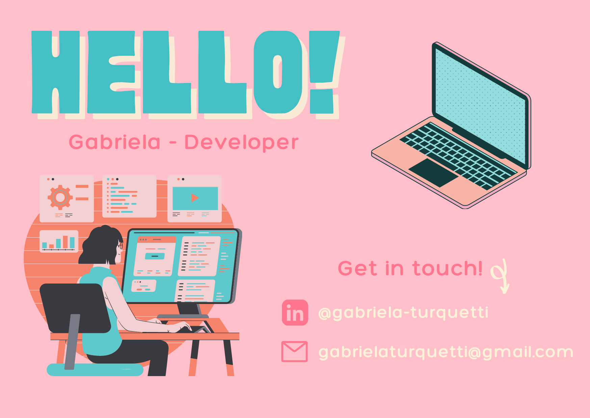

# Hi, I'm Gabriela! 👻

I'm a geophysicist working my way through code and I love challenges!

My journey started in early 2020 when I was selected to be a part of the course that changed my life "{reprograma} Front-End Development Bootcamp". It was an amazing experience during these 8 weeks learning about HTML, CSS and JavaScript. I kept studying through the year and now, in 2021, I was choosen to join the "VAMO AI", a 6-month program to develop 35 people to become Jr. Data Analysts. So now, my current challenges are:

- **6-month Data Analysis Course**: build applications with Python, MongoDB and Docker.
- **Ratas**: project designed to build an Art Gallery using Ghost, Gatsby and React applications. 
